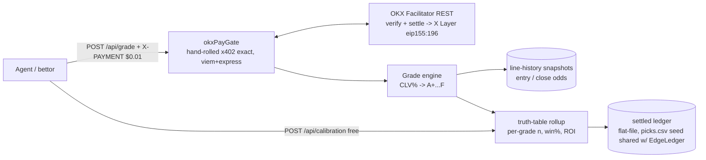
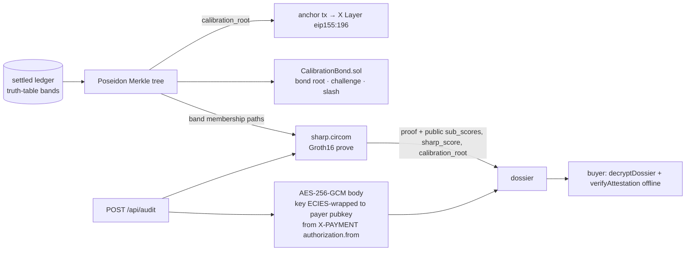

# ARCHITECTURE — CLV Scout

## Shape

Same repo, same server family as EdgeLedger's OKX rail — a **second Express app entry** (`apps/clvscout` or `server-clvscout.ts`) sharing `engine/`, `db/`, and `api/rails/okx.ts`, deployed as its own service with its own domain + listing. Separate deployment (not a route on EdgeLedger) because each okx.ai listing needs its own endpoint identity and independent review fate.



## Endpoints

### Core service (listed Jul 15)

| Route | Gate | Request | Response |
|---|---|---|---|
| `POST /api/grade` | **$0.01 x402** | `{match, selection, odds_taken, book?, placed_at?}` | `{clv_grade, clv_pct, beat_close, close_odds, close_source, grade_truth:{n, win_rate, roi_pct}, advice, you:{your_grades, your_beat_close_rate}, provenance:{line_history_source, snapshot_at}}` — or `{clv_grade:"UNGRADED", reason, covered_markets_hint}` |
| `POST /api/audit` | **$0.20 x402** | `{bets:[{match, selection, odds_taken, …} ×≤25], label?}` | **CLV dossier**: `{per_bet:[…grades], beat_close_rate, grade_distribution, weighted_expectancy, sharp_score:{value, sub_scores:{clv_mean, consistency, grade_mix, sample}}, graded, ungraded, verdict_line}` |
| `POST /api/calibration` | free | `{}` | `{bands, table:[{grade, n, win_rate, roi_pct}], window, methodology, last_settled_at}` |
| `POST /api/me` | free | `{address}` (+`forget:true`) | buyer's grading history (shared BuyerLens module) |
| `POST /api/receipts/verify` | free | `{txHash}` | live settlement re-check via Facilitator `GET /settle/status` (shared module) |
| `GET /api/grade` | — | | `405` |

### Tier-2 service (registered after CLV Scout's own listing passes)

| Route | Scheme | Pricing | Doc basis |
|---|---|---|---|
| `POST /api/grade-stream` | **`aggr_deferred` Batch** — buyer signs per call with an Agentic-Wallet **Session Key**; Broker aggregates in a **TEE** into one on-chain tx; seller forwards `accepted.extra.sessionCert` verbatim; settle is intake-only → txHash via `GET /settle/status` | $0.005/call, tens of calls/min | methods-overview (Batch = SDK ✅ HTTP Seller, "very small per-call amount + very high frequency") + core-concept §Batch + facilitator API §A5. Fallback: plain `exact` $0.005 |

**Routes map (the only payment config):**

```ts
export const clvPayGate = paymentMiddleware(
  {
    "POST /api/grade": {
      accepts: [{ scheme: "exact", network: NET, payTo: PAYTO, price: "$0.01" }],
      description: "CLV Scout — grade a placed World Cup bet against the closing line; returns grade, CLV%, and the settled truth table for that grade.",
      mimeType: "application/json",
    },
    "POST /api/audit": {
      accepts: [{ scheme: "exact", network: NET, payTo: PAYTO, price: "$0.20" }],
      description: "CLV Scout audit — up to 25 placed bets → full CLV dossier: per-bet grades, beat-close rate, Sharp Score with origin-disclosed sub-scores.",
      mimeType: "application/json",
    },
    // Tier 2 (post-listing): "POST /api/grade-stream" under aggr_deferred — config per methods-batch page (Day-1 doc fetch)
  },
  resourceServer, // same OKXFacilitatorClient/ExactEvmScheme instance factory as EdgeLedger
);
```

## Grading math (all in one tested module)

1. Normalize input odds → implied prob `p_taken = 1/odds_taken`.
2. Find closing odds for the same market from line-history snapshots (captured at kickoff by the shared snapshot job) → `p_close`.
3. `clv_pct = (p_close − p_taken) / p_taken × 100` (positive = you beat the close).
4. Band → grade; join grade → truth table from settled ledger rows graded the same way.
5. No close found → `UNGRADED` (tested refusal path; never interpolate a close).

## Data

- **Line-history:** the shared odds snapshot job (already capturing entry + closing lines for EdgeLedger's CLV column) — CLV Scout reads the same store; coverage = the markets we snapshot, stated in `/api/calibration`.
- **Truth table:** aggregation over settled ledger rows; recomputed on settle, cached in-process with `last_settled_at`.

## Config

| Env | Value |
|---|---|
| `PAY_RAIL` | `okx` |
| `X402_NETWORK` | `eip155:1952` → `eip155:196` |
| `CLV_PAYTO` | optional separate receive address (else shared `PAYTO_ADDRESS`) |
| Domain | `https://api.clvscout.edycu.dev` |
| Price/asset | `"$0.01"` in USD₮0 `0x779ded0c…3736` (zero-gas — the whole reason 1¢ works) |

## Invariants (tested)

1. Unpaid `POST /api/grade` and `POST /api/audit` → 402 with `x402Version:2`; never reach the grade engine.
2. `UNGRADED` whenever close data is absent — no synthetic closes, ever; dossiers report `graded/ungraded` counts.
3. Truth-table rows sum to the settled-ledger count; per-grade ROI recomputable by the shared audit script.
4. `/api/calibration`, `/api/me`, `/api/receipts/verify` free under all configs; band constants in responses match the constants in code (single source).
5. **Sharp Score decomposes:** `sharp_score.value` recomputes from its published sub-scores (test: recompute from `sub_scores`, assert equality) — no opaque composite.
6. **Batch isolation (Tier 2):** `sessionCert` is forwarded verbatim and never written into `paymentRequirements.extra` (doc rule, §A5); `grade-stream` registration never modifies the approved core service.

## Tier-3 surfaces (Complexity Gauntlet)

> Post-gate depth ceiling — spec/whitepaper-complete, **not built**, never a precondition to listing. Feasibility labels + full detail in `SPEC.md` and `COMPLEXITY.md §TIER 3`. Shared primitives are referenced from EdgeLedger Tier-3, not duplicated.

**New files:**

| File | Role | Feasibility |
|---|---|---|
| `circuits/sharp.circom` | Groth16 zk-Sharp circuit: recompute + calibration-membership | ROADMAP |
| `contracts/CalibrationBond.sol` | stake/slash bond on `calibration_root`; fraud-proof challenge | ROADMAP |
| `sdk/` (**shared** — `@clvscout/sdk` on the EdgeLedger SDK core) | `grade/audit/calibration/verifyAttestation/decryptDossier/verifyReceipt` | POST-GATE STRETCH |
| `bin/clvscout` | CLI mirroring the SDK (`grade/audit/verify [--offline]/bench`) | POST-GATE STRETCH |
| `verify_offline.ts` (**shared**) | air-gapped Groth16 + calibration Merkle re-verify | ROADMAP |
| `app/integrations/verify` | live anchor-tx / bond-balance / recompute-widget page | ROADMAP |
| `mcp/server.ts` (`clvscout mcp`) | MCP stdio tool server over the SDK (`grade/audit/calibration/verify_receipt/verify_attestation`) — `onchainos mcp` pattern | POST-GATE STRETCH |
| `api/pnlcontext.ts` | optional `wallet` → `pnl_context` dossier block via `onchainos market portfolio-overview` / `workflow wallet-analysis` | POST-GATE STRETCH |
| `jobs/discovery.ts` | audit-target proposals via `onchainos tracker activities` / `signal list` / `leaderboard list` | ROADMAP |
| `evaluator/` (role config + vote playbook) | ERC-8004 Evaluator: `agent create --role evaluator` + OKB `stake` lifecycle + `vote-commit`/`vote-reveal` dossier-as-voteReport | ROADMAP |
| `scripts/paydemo.sh` | CI payer: `onchainos payment pay`/`pay-local` round-trip (testnet 1952 + Mock Merchant → mainnet) | POST-GATE STRETCH |
| readiness script `x402-check` line | `onchainos agent x402-check --endpoint … --body …` must extract $0.01/$0.20 pre-registration | SHIPPABLE IN WINDOW |
| SDK/CLI pre-sign hooks (**shared**) | `onchainos security sig-scan`/`dapp-scan`/`approvals` — advisory, never a payment precondition | POST-GATE STRETCH |
| A2A service entry + task playbook | Task-Hall provider: `agent recommend-task`→`apply`→`deliver` ("audit this tout" as negotiated task; second `serviceType:"A2A"` on the same ASP) | ROADMAP |
| verify-page reputation + balance widgets | `agent feedback-list --agent-id` review feed · `portfolio token-balances` PAYTO/bond balance | ROADMAP |
| ops runbook lines | `agent heartbeat` keep-alive · `onchainos preflight` CI drift check | POST-GATE STRETCH |
| charge-link + splits flow | `payment a2a-pay create` dossier sale links · MPP `charge` `methodDetails.splits[]` (≤10) reseller cuts | ROADMAP |

**Onchain OS toolchain grounding (v3):** every command above verified against the installed `onchainos` CLI v4.2.4 `--help` output (see `COMPLEXITY.md §TIER 3+`). Buyer note: `payment pay-local` supports `exact+EIP-3009` / `exact+Permit2` / `upto` but **not** `aggr_deferred` (TEE-only) — Tier-2 batch demos must use `payment pay` (Agentic Wallet TEE).

**Flow — zk-Sharp attest + calibration bond + pay-to-decrypt:**



**New tested invariants (Tier 3):**

7. **Sharp recomputes in-circuit against `calibration_root`:** the Groth16 proof verifies iff `sharp_score == Σ sub_scores` **and** every per-bet grade's band is a Poseidon-Merkle member of the public `calibration_root` (the ARCHITECTURE inv. 5 recompute, now zk-enforced against the committed table).
8. **Bonded root == anchored root:** the `calibration_root` staked in `CalibrationBond.sol` equals the root anchored on X Layer and echoed by `/api/calibration`; a fraud proof succeeds iff a bonded band diverges from the recomputation over the public settled ledger.
9. **Dossier undecryptable without the payment key:** the AES-256-GCM body only opens with the content key ECIES-wrapped to the payer's payment public key (`authorization.from`); no valid EIP-3009 payment ⇒ no key ⇒ ciphertext only (the paywall is cryptographic). Sub-scores + attestation ride outside the envelope and stay publicly re-checkable.
10. **MCP never bypasses x402 (v3):** `clvscout mcp` tool calls hit the same paid handlers — a paid tool call returns the 402 challenge payload for the harness to sign (e.g. `onchainos payment pay`) and replay; no unpaid path exists through the MCP transport.
11. **`pnl_context` is advisory (v3):** the OKX-sourced raw-P&L block is provenance-stamped, carries its DEX-PnL caveat, and is never an input to `sharp_score` — the score stays pure CLV (test: audit with and without `wallet` yields identical `sharp_score`).

## Residual risks

- **Market-matching ambiguity** (user says "England −1.5", snapshot says "ENG AH −1.5"): mitigate with a small alias map + UNGRADED fallback; v1 coverage honestly narrow.
- **Thin per-grade samples** early in the ledger: return `n` prominently and a `low_sample: true` flag under n<10 rather than hiding it.
- **Review load double-dip:** second listing = second 24h review; only attempt after the primary passes (gate).
