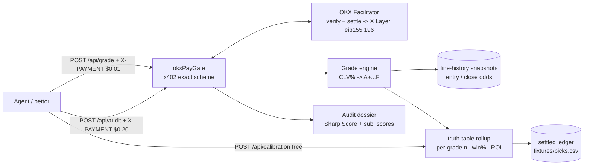

<div align="center">
  
  <h1>CLV Scout 🎯</h1>
  <p><em>You can win the bet and still be wrong — grade every pick against the closing line, not the scoreboard.</em></p>
  

  <br/>

  [](https://clvscout.edycu.dev/)
  [](https://clvscout.edycu.dev/pitch)
  [](https://youtube.com/placeholder)
  [](https://www.hackquest.io/hackathons/OKXAI-Genesis-Hackathon)

  <br/>

  
  
  
  
  
  
  [](https://github.com/edycutjong/clvscout/actions/workflows/ci.yml)

</div>

---

## 💡 The Problem & Solution

Short-run results are noise. The professional gold standard for whether a bet
was actually *good* is **Closing Line Value (CLV)** — did the price you took
beat the market's final price? Measuring it requires closing-odds capture,
grading discipline, and a settled sample to calibrate grades against. Retail
bettors and copy-trading agents have none of that. Meanwhile the leaderboards
they *do* have all rank by raw P&L — the exact metric CLV exists to correct.

**CLV Scout** is a micro-priced A2MCP grader: paste a bet you placed (or up to
25 of someone else's), pay a cent or two, and get back a calibrated grade —
not an opinion, a number backed by a settled truth table you can independently
recompute.

**Key Features:**
- 🎯 **`POST /api/grade` ($0.01)** — grades one bet: `clv_grade` (A+…F), `clv_pct`,
  `beat_close`, and the settled truth table for that exact grade band (`n`, `win_rate`, `roi_pct`).
- 📋 **`POST /api/audit` ($0.20)** — up to 25 bets → a full CLV dossier: beat-close
  rate, grade distribution, weighted expectancy, and an origin-disclosed
  **Sharp Score (0–100)** — the direct answer to raw-P&L leaderboards.
- 🚫 **UNGRADED honesty path** — if we don't have a recorded closing line for a
  market, the response is `clv_grade: "UNGRADED"` with a reason. Never a
  guessed or interpolated close.
- 📖 **Free `POST /api/calibration`** — the full grade→outcome truth table plus
  the exact methodology text, computed live from the settled ledger, not
  hardcoded prose.
- 🔐 **BuyerLens-lite** — `POST /api/me` returns a payer's own grading history
  keyed off their `X-PAYMENT` signature (payment identity doubles as login).
- 🧾 **`POST /api/receipts/verify`** — free re-check of any settlement via the
  Facilitator's `GET /settle/status`.

## 🏗️ Architecture & Tech Stack

| Layer | Technology |
|---|---|
| **Runtime** | Node.js 20+, TypeScript (strict), `tsx` (no build/bundle step) |
| **API** | Express 4 |
| **Payments** | OKX x402 `exact` scheme, EIP-3009/EIP-712 (`viem`), X Layer `eip155:196` |
| **Validation** | `zod` |
| **Data** | Flat-file settled ledger + line-history snapshots (`fixtures/`), no DB server |
| **Testing** | Vitest — 124 tests, `@vitest/coverage-v8` |



Self-contained sibling of **EdgeLedger** (same OKX rail shape, separate
service and listing) — see [`ARCHITECTURE.md`](ARCHITECTURE.md)  for the full spec.

## 🏆 Why ONLY OKX

1. **`price: "$0.01"` with real settlement.** The SDK converts a one-cent USD
   string into atomic USD₮0 and the Facilitator settles it on X Layer per
   call. On a general-purpose EVM rail, a $0.01 payment is un-economic the
   moment anyone pays gas.
2. **USD₮0 zero-gas promo** (`0x779ded0c…3736`) makes the buyer's marginal
   cost exactly one cent — the only thing that makes "audit a tout's last 25
   picks for $0.20" a rational agent action.
3. **Multi-route pricing in one middleware** — `"$0.01"` grade and `"$0.20"`
   audit are two entries in the same routes map; tiered pricing costs a
   config block, not an integration.
4. **Public sold counts on the marketplace** — the 1¢-volume thesis is
   verifiable by judges without trusting us.
5. **Same `exact`/EIP-3009 wire as the primary**, plus shared v2 modules:
   `X-PAYMENT`-identity BuyerLens and Facilitator `GET /settle/status` receipt
   re-verification.

Take OKX out and the product dies at the till: no micro-payment rail clears
$0.01 profitably off the zero-gas promo, and there's no Session-Key + TEE
aggregation stack for sub-cent streaming elsewhere. The grader is portable —
**the economics are OKX-specific.** Full brief: [`SPONSOR_DEFENSE.md`](SPONSOR_DEFENSE.md).

## 💥 The Money Shot

A tout posts his last 5 World Cup moneyline picks. Naive record on flat
1-unit stakes: **3 wins, 2 losses, net +12.0% raw ROI** — looks like someone
worth following. Feed the exact same 5 picks to `/api/audit` ($0.20) against
the real, settled closing-line ledger:

```json
{
  "graded": 5,
  "beat_close_rate": 0.2,
  "grade_distribution": { "A+": 0, "A": 1, "B": 0, "C": 1, "D": 2, "F": 1 },
  "weighted_expectancy_pct": -22.14,
  "sharp_score": { "value": 40.7 },
  "verdict_line": "Sharp Score 40.7/100 — the record may look fine on raw P&L, but the numbers that predict future results say otherwise."
}
```

Only 1 of 5 picks beat the closing line. **+12% raw ROI, Sharp Score
40.7/100.** Every number above is real, unmodified output from this build
against the shared 24-row settled seed ledger — nothing here is scripted or
hand-typed. Full walkthrough (including the "won the bet and still made a
mistake" single-grade reveal, and the UNGRADED honesty path) is in
[`DEMO.md`](DEMO.md).

## 🚀 Getting Started

### Prerequisites
- Node.js ≥ 20
- npm

### Installation

```bash
npm install
cp .env.example .env      # optional — faithful-local mode works with no keys
npm run gen-line-history  # regenerate fixtures/line-history.json from picks.csv (already committed)
npm run settle            # compute CLV%/grade per row + truth table -> fixtures/ledger-settled.json
npm run typecheck
npm test                  # 124 vitest, offline
npm run api               # boots on :4021
```

**Then open [http://localhost:4021/](http://localhost:4021/)** — a served **visible proof page** that drives the live paid API and *renders* the reveal: the tout who's "+12% / 3-2" collapsing to a red **Sharp Score 40.7/100**, the **WON-but-graded-C** card, the UNGRADED refusal, and the live calibration table. Every button fires a real x402 round-trip (probe → 402 → sign EIP-3009 → pay → 200), signed server-side with a throwaway key because browsers can't sign — nothing on the page is mocked (`web/`, `api/demoRunner.ts`). This is the 90-second demo surface — see [`DEMO.md`](DEMO.md).

Or drive it from the terminal:

```bash
npm run buyer POST /api/grade '{"match":"NED vs URU","selection":"Netherlands to advance","odds_taken":1.88}'
```

`scripts/buyer.ts` does the full round trip: probes the route unpaid, reads
the 402 challenge, signs a real EIP-3009 `TransferWithAuthorization` locally
(throwaway key), and replays with `X-PAYMENT`.

> **For judges:** no account, no faucet needed to inspect the flow — every
> paid route responds to an unpaid `curl` with a real 402 challenge (see
> Self-Check below), and `npm run readiness` boots an ephemeral instance and
> runs that exact check for you.

## 🌐 Docs site (GitHub Pages)

A self-contained static landing page lives in [`docs/`](docs/), wired to publish to
**GitHub Pages** at the target domain **[clvscout.edycu.dev](https://clvscout.edycu.dev/)** (custom domain via
[`docs/CNAME`](docs/CNAME)) — the product story, the x402 paid-edge flow, the endpoint
surface, and the money-shot output, fronted by the animated hero. **Not yet live** (this repo
is not pushed as of this snapshot — see §Limitations). The page is **static**,
so the *interactive* demo (`web/index.html`) is served by the **API** at the target
**api.clvscout.edycu.dev** (`npm run api` locally); the Pages site shows the real sample
output and links back to this repo.

**Publishing:** [`.github/workflows/pages.yml`](.github/workflows/pages.yml) deploys
the `docs/` folder to Pages on every push to `main`. One-time repo setup:
**Settings → Pages → Source = "GitHub Actions"**.

## 🧪 Testing & CI

**5-stage pipeline:** Quality → Security → Build → API Smoke → Deploy Gate

```bash
# ── Code Quality ────────────────────────────
npm run typecheck      # tsc --noEmit
npm test               # 124 tests (vitest)
npm run test:coverage  # vitest run --coverage
npm run ci             # lint + typecheck + coverage

# ── API self-check ──────────────────────────
npm run readiness      # boots an ephemeral instance, checks 402/402/405/200 + truth-table sums
```

| Layer | Tool | Status |
|---|---|---|
| Code Quality | TypeScript strict (`tsc --noEmit`) | ✅ |
| Unit Testing | Vitest — **124 tests (17 files)** | ✅ |
| Coverage | `@vitest/coverage-v8` (engine/api/db ~75%) | ✅ |
| API Smoke | live-boot 402/402/405/200 self-check (CI + `npm run readiness`) | ✅ |
| Security (SAST) | CodeQL (`javascript-typescript`) | ✅ |
| Security (SCA) | Dependabot (npm + github-actions) + `npm audit` | ✅ |
| Secret Scanning | TruffleHog | ✅ |
| License Compliance | `license-checker` (GPL/AGPL gate) | ✅ |
| CI/CD Pipeline | 5-stage, parallel, concurrency-controlled | ✅ |

### Self-check (listing gate)

```bash
curl -i -X POST http://localhost:4021/api/grade        # -> 402, x402Version:2
curl -i -X POST http://localhost:4021/api/audit        # -> 402, x402Version:2
curl -i -X GET  http://localhost:4021/api/grade        # -> 405
curl -i -X POST http://localhost:4021/api/calibration  # -> 200
```

## 📁 Project Structure

```
clvscout/
├── config.ts                  # env + constants (single source)
├── engine/
│   ├── prob.ts, clv.ts        # vendored from EdgeLedger's engine/{edge,clv}.ts
│   ├── types.ts               # CLV Scout domain types
│   ├── grade.ts               # grade bands, truth-table math, Sharp Score (pure)
│   ├── grader.ts              # line-history lookup + grade.ts -> GradeOutcome
│   └── dossier.ts             # /api/audit aggregation
├── data/lineHistory.ts        # closing-line snapshot lookup (never interpolates)
├── db/csv.ts, ledger.ts       # picks.csv parsing + settled-ledger/truth-table build
├── api/
│   ├── rails/okx.ts           # the OKX x402 payment rail
│   ├── buyerlens.ts           # X-PAYMENT identity -> /api/me history
│   ├── receipts.ts            # /api/receipts/verify wiring
│   ├── demoRunner.ts          # real x402 round-trip for the proof page (POST /api/demo/run)
│   └── routes.ts, server.ts   # Express app (+ serves web/ at /)
├── web/                       # served visible proof page (index.html) — the demo surface
├── scripts/                   # gen-line-history, settle, audit, buyer, readiness
├── fixtures/                  # picks.csv (shared with EdgeLedger), line-history.json, ledger-settled.json
├── test/                      # 124 vitest across 17 files
├── ARCHITECTURE.md            # full system spec (flows, invariants, Tier map)
├── docs/                      # GitHub Pages site (index.html) + animated hero/icon
├── .github/                   # CI workflows, CodeQL, Dependabot, community health files
├── .env.example               # environment template
└── README.md                  # you are here
```

## ⚠️ Limitations / What's Mocked / What's Next

- **Self-contained facilitator, not a mock.** The real `@okxweb3/x402-express` +
  `x402-core` + `x402-evm` packages install cleanly and match the documented
  wire shapes — the **server-side** `ExactEvmScheme` lives at the subpath
  `@okxweb3/x402-evm/exact/server` (the sibling **EdgeLedger** build imports it
  there and wires it for real). CLV Scout deliberately keeps *this* listing
  **zero-dependency on `@okxweb3`**: `api/rails/okx.ts` hand-rolls the same
  documented wire shapes with only `viem` + `express`, so it installs, boots,
  and unit-tests the payment leg fully offline. **EIP-3009/EIP-712
  signature verification is real, offline cryptography** (`viem`'s
  `recoverTypedDataAddress`), exercised end-to-end by `scripts/buyer.ts`
  against a live server. Without `OKX_API_KEY`/`OKX_SECRET_KEY`/`OKX_PASSPHRASE`
  set, settlement is recorded as an honestly-labeled **local-pending**
  receipt instead of a live Facilitator call — the payment signature check
  still runs for real either way.
- **Real closes only — UNGRADED otherwise.** There is no synthetic-close code
  path anywhere in this codebase. A market without a recorded closing-line
  snapshot returns `clv_grade: "UNGRADED"` with a reason, never an invented
  number (`engine/grader.ts`).
- **Grade bands are chosen, not curve-fit.** The A+…F thresholds are fixed
  round-number CLV cutoffs decided up front — they are not tuned to make this
  particular 24-row seed ledger look good, and `/api/calibration` states that
  explicitly alongside the live truth table.
- **Not deployed.** This harness targets `https://api.clvscout.edycu.dev`
  (landing/pitch on `clvscout.edycu.dev` via Pages), but as of this snapshot the service runs locally
  only (`npm run api`) — no live URL, no on-chain settlement receipt yet.
  Treat every number in this README as reproducible from source, not as a
  claim of a hosted, judged deployment.
- **Narrow market coverage by design.** World Cup 2026 knockout markets only
  (`fixtures/picks.csv`); coverage is stated in every `/api/calibration`
  response rather than hidden.
- **Out of scope (Tier 1 only).** No `POST /api/grade-stream` (`aggr_deferred`
  batch, Tier 2), no zk/bond/SDK/MCP (Tier 3).
- **Known dev-dependency advisory.** `npm audit` reports moderate/high/critical
  findings in `vitest`'s transitive `esbuild`/`vite` chain (test-runner only,
  not shipped in the running service); CI runs it as advisory
  (`continue-on-error`) and Dependabot tracks upstream fixes rather than
  force-upgrading mid-build and risking the 124-test suite.

## 📄 License
[MIT](LICENSE) © 2026 Edy Cu

## 🙏 Acknowledgments
Built for **OKX.AI Genesis 2026**. Thank you to OKX for the x402 payment rail,
the X Layer zero-gas USD₮0 promo, and the Onchain OS / Agentic Wallet tooling
that makes a $0.01 API call an economically real product.
